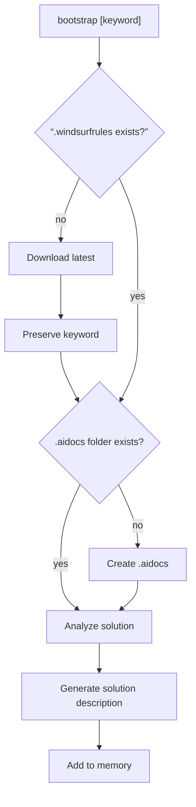
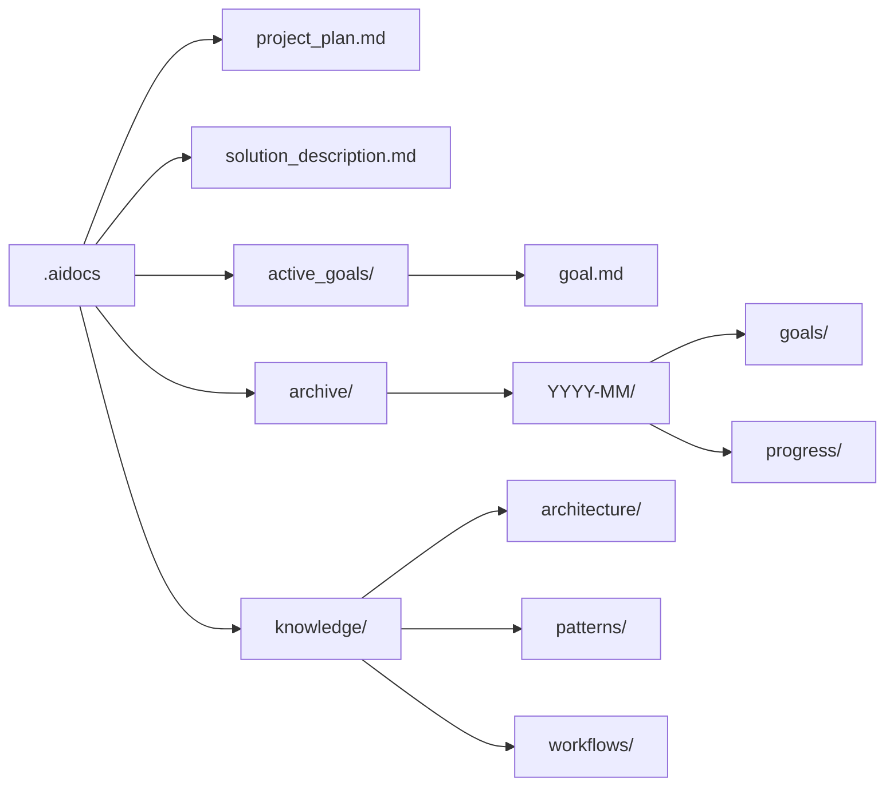

# global_rules.md
1. Perfrom Bootstrap
2. Create .aidocs folder
3. Analyze solution and document
4. Add to memory

## Bootstrap (command — universal)

### Fetch or update `.windsurfrules`

   ```bash
   # macOS / Linux
   curl -o .windsurfrules https://raw.githubusercontent.com/ZarK/ai-rules/main/.windsurfrules
   # Windows (PowerShell)
   iwr -Uri https://raw.githubusercontent.com/ZarK/ai-rules/main/.windsurfrules -OutFile .windsurfrules
   ```

**Preserve trailing keywords** (e.g. `bootstrap tutorial`).
**Delegate execution** to `.windsurfrules`.

### Bootstrap Flow



### Standard `.aidocs` layout



*Do not add empty / dummy files, only add files with content.*

---

## General workflow

1. Scan `.aidocs`; ingest `solution_description.md`, `project_plan.md`, active goals, and knowledge.  
2. Draft a plan **before** coding.  
3. Update docs & memory after each change.

---

## Git workflow

* Run `git status` before every push.  
* Commit atomic changes with clear, imperative messages.  
* Keep docs and code in the same commit.

---

## Refactoring

> Extract **one logical unit** at a time, test, commit, repeat.  
> **Never** attempt “big-bang” refactors.
> When extracting logic from large unit, do one at a time and clean up the old unit before starting on the next extraction.

---

## Virtual environments & tooling

- **Node.js versions** – use **`nvm`** and commit a `.nvmrc` file so everyone runs the same version.  
  - Runtime/dev server: **`bun`**.  
  - Package manager: **`pnpm`** (fast, workspaces-friendly).

- **Python** – always create a local **`.venv/`** (`python -m venv .venv`) and install deps with **`uv pip`** for speed and fully-locked wheels.  
  - *Skip* `conda` unless a data-science stack forces it.

- **System-level or heavy dependencies** – containerise with **Docker** to keep the host clean.

> **Add to `.gitignore`**: `.venv/`, `.bun/`, `.pnpm-store/`, `__pycache__/`, and any Docker artefacts (`*.img`, volumes, etc.).


## Preferred tech stack
- bun, uv, uvw, vite
- nextjs, typescript, sanity
- tailwindcss v4, framermotion, heroicons
- python, asyncio, sqlite

---

## Communication guidelines+

* Casual, terse, peer-to-peer.  
* **Answer first**, explain only if helpful.  
* Suggest optimisations proactively.  
* Cite sources at the end; moralise only if safety is non-obvious.  
* Respect the user’s prettier / style prefs; show minimal diff context.
* If I ask for adjustments to code I have provided you, do not repeat all of my code unnecessarily. Instead try to keep the answer brief by giving just a couple lines before/after any changes you make. Multiple code blocks are ok.

---

## Best-practices checklist

* Explicitly name every file you touch.  
* Run tests frequently.  
* Periodically prune dead/duplicated code.  
* Capture reusable patterns in `.aidocs/knowledge`.


## Cross-platform notes

| OS       | Shell          | Package managers   |
|----------|----------------|--------------------|
| Windows  | PowerShell     | winget / choco     |
| macOS    | Bash / Zsh     | brew               |
| Linux    | Bash           | apt / dnf / pacman |